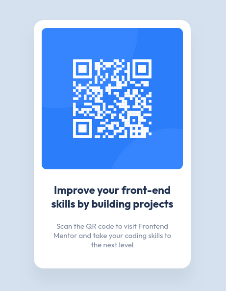

# Frontend Mentor - QR code component solution

## Table of contents

- [Overview](#overview)
  - [Screenshot](#screenshot)
  - [Links](#links)
- [My process](#my-process)
  - [Built with](#built-with)
  - [What I learned](#what-i-learned)
  - [Continued development](#continued-development)
  - [Useful resources](#useful-resources)
- [Author](#author)
- [Acknowledgments](#acknowledgments)

## Overview

### Screenshot

### Links

- Solution URL: https://github.com/surrealgee/qr-code-component
- Live Site URL: https://surrealgee.github.io/qr-code-component/

## My process

### Built with

- HTML
- CSS

### What I learned

This one was pretty easy to complete, my intention here was to get started with project based learning.

I intent to develop new projects every week to find gaps in my knowledge and become a better developer overall.

### Continued development

I don't see the need to add more features to this projects for the moment.

What I want to do is improve my writing skills be writing documentation about my projects.

That's why started with this easy one so I could focus on writing this document and establishing a baseline for future projects.

### Useful resources

https://fonts.google.com/

## Author

- Website - https://github.com/surrealgee
- Frontend Mentor - https://www.frontendmentor.io/profile/surrealgee

## Acknowledgments

This is a solution to the [QR code component challenge on Frontend Mentor](https://www.frontendmentor.io/challenges/qr-code-component-iux_sIO_H). Frontend Mentor challenges help you improve your coding skills by building realistic projects.
